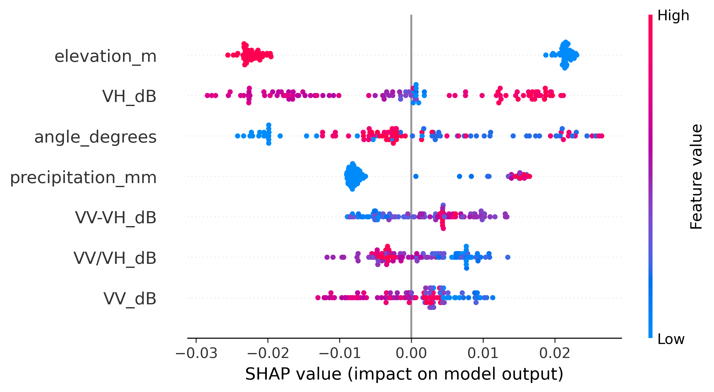
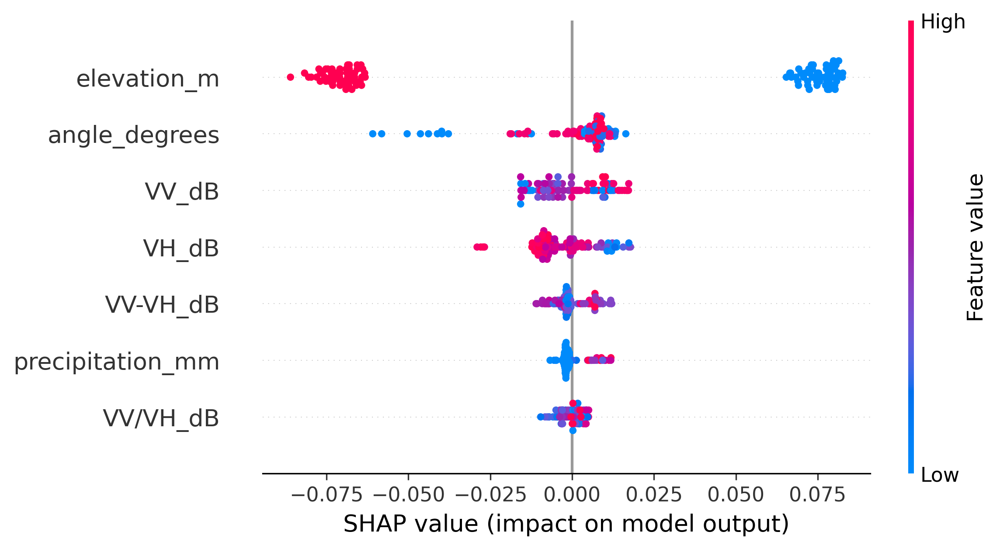
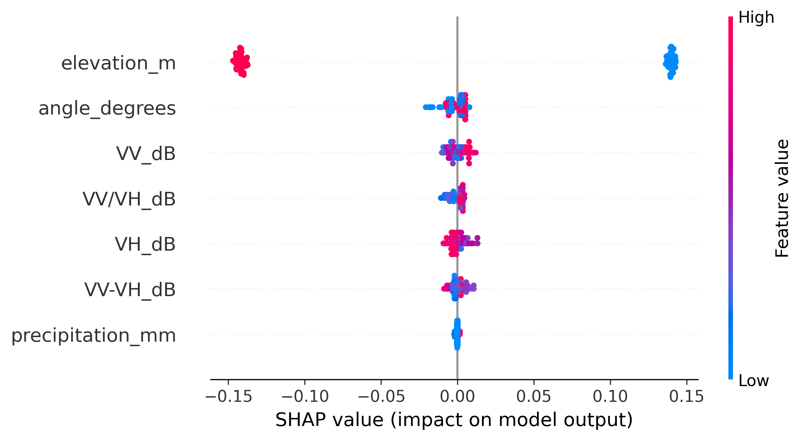
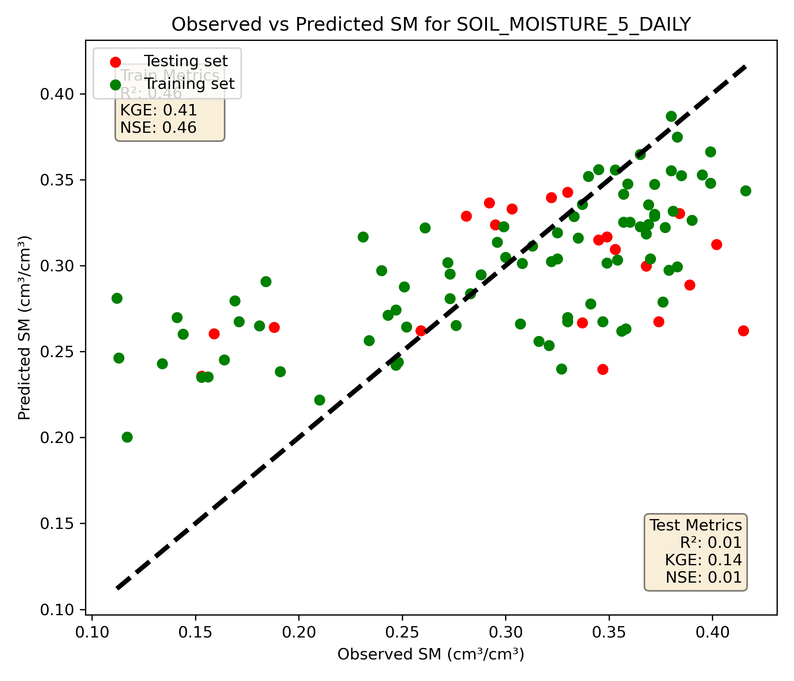
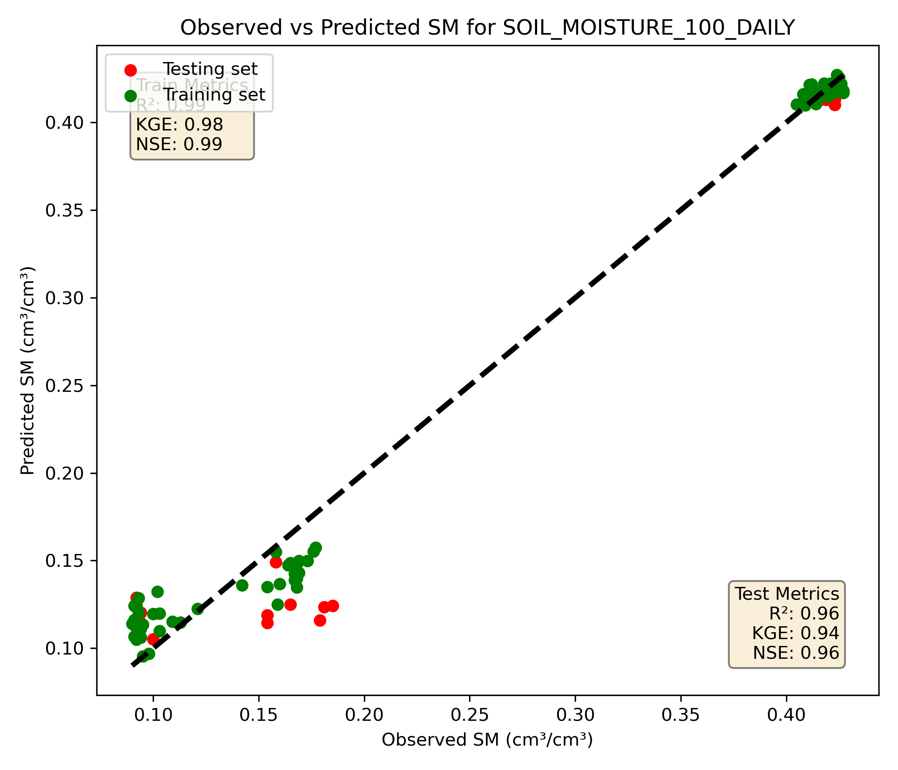
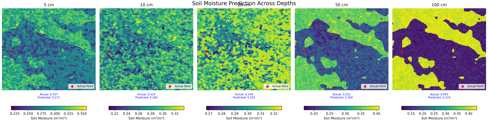
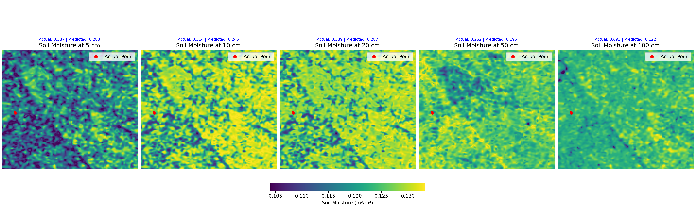
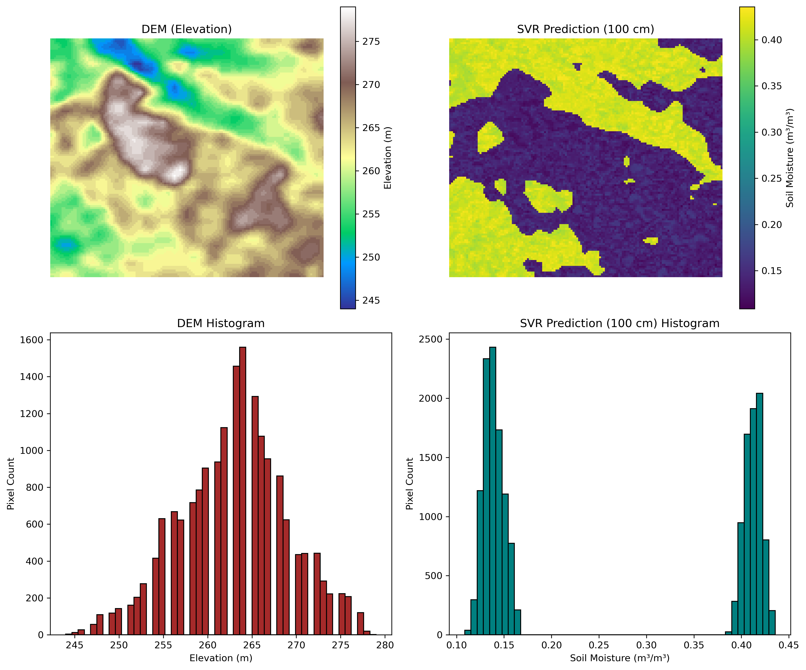

# SoMoBoost

## Overview  
This project involves downloading and preprocessing soil moisture data from various sources (in-situ measurements, satellite imagery, and precipitation/elevation datasets), followed by training a machine learning model using Extreme Gradient Boosting and Support Vector Regressor to predict soil moisture at 5 cm, 10 cm, 20 cm, 50 cm and 100 cm depths. The model leverages remote sensing input features, including:  

- VV [dB]  
- VH [dB]  
- Incidence angle [degrees]  
- Precipitation [mm]  
- Elevation [m]  
- VV–VH [dB]  
- VV/VH ratio   

Once trained, the model can predict depth-specific soil moisture directly from image-based input layers such as GeoTIFFs, enabling spatially continuous soil moisture estimation.  

## Special Thanks  

This project was a part of my Independent Study Course with Prof. Dr. Nagesh Kumar Dasika, who was a Curtis Visiting Professor at Purdue University. The course, titled *Digital Image Processing using Machine Learning Algorithms*, provided me with invaluable learning opportunities.  

I would like to express my heartfelt gratitude to Prof. Dr. Nagesh Kumar Dasika for his guidance and support throughout this project.  

Special thanks to Jibin Joseph, the Teaching Assistant for the course, who has been a constant source of help and encouragement.  

Lastly, I would like to acknowledge my supervisor, Prof. Dr. Venkatesh Merwade, who first encouraged me to undertake this independent study course with Prof. Dr. Nagesh Kumar Dasika.  

## Steps to Reproduce  

### 1. Download the Data  
- Visit [ISMN Data Viewer](https://ismn.earth/en/dataviewer/).
- **Select Your Stations:** Navigate to your area of interest on the map and    select the stations you want to download.
    


- Select stations and download the data.  
- For this project, data from the following stations were used:  
    - Urbana Champaign, Illinois  
    - Bloomington, Indiana  
    - Near Lexington, Kentucky  
    - Near Bowling Green, Kentucky
     

### 2. Set Up the Python Environment  
- Create a Python environment using the `SM_env.yaml` file.  
- Open your terminal and install Anaconda if not already installed.  
- Clone this repository:  
    ```bash  
    git clone <https://github.com/ShishirBro/SoMoBoost.git>  
    ```  
- Install the environment:  
    ```bash  
    conda env create -f SM_env.yaml  
    conda activate SM_env  
    ```  

### 3. Preprocess the Data  
- Create a unique coordinates shapefile to extract SAR, CHIRPS, and SRTM datasets.  
- Follow the steps in the `preprocess_insitu.ipynb` notebook up to cell 4.  

### 4. Download Input Features  
- Use Google Earth Engine to download input features:  
    - Copy and paste the code from `SAR_SMproj` into the Earth Engine Code Editor.  

### 5. Aggregate and Clean Data  
- Aggregate all downloaded data into a text file.  
- Open the `preprocess_insitu.ipynb` notebook:  
    - Clean outlier values.  
    - Match Sentinel data dates with in-situ soil moisture values.  
    - Generate the final dataset ready for machine learning.  

### 6. Train the Machine Learning Model  
- Open the `Main_ML.ipynb` notebook and execute all cells.  
- Test the model using the `FrankFort_Lexington_Multiband_2024.tif` file, which is a TIFF image downloaded from Google Earth Engine.  
- To learn how to download this image, refer to the code in `Image_SM_proj_DNK`.  

### 7. The results of Feature Engineering:
  
  
  


### 8. The results of Model Training look like this: 
  
  


### 9. The results of predicted Soil Moisture Just Based on the input Features look like this:
  
  

### 10. As the results of 100 cm from XGboost had very high feature relationship with DEM. We tried to see how well it resembles.
  


## Notes  
- Ensure all dependencies are installed as specified in the `SM_env.yaml` file.  
- Follow the notebooks step-by-step for reproducibility.  

